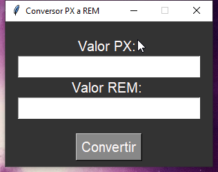
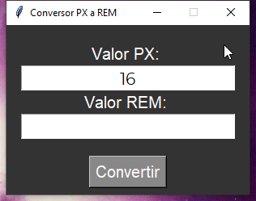
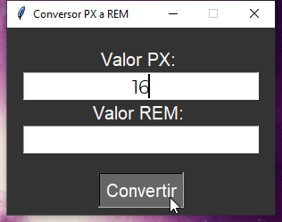
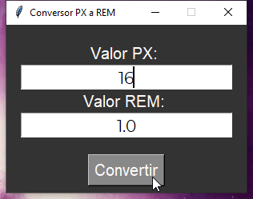

# Pixel to REM Conversor.

### Hecho por [YirsisHertz](https://www.youtube.com/channel/UC30q5sUntEDAKIgkk8bmgpg)

- [Udemy](https://www.udemy.com/user/yirsis-aldebrand-serrano-herrera/)
- [YouTube Channel](https://www.youtube.com/channel/UC30q5sUntEDAKIgkk8bmgpg)
- [GitHub Profile](https://github.com/YirsisHertz)

## `Compilación Previa`
Este proyecto esta hecho con el lenguaje Python y precompilado en formato `.exe` dentro de la carpeta `dist/` del proyecto.

## `Compilación Manual`

Si necesitas compilar manualmente el proyecto deberas instalar el paquete de [pyinstaller](https://pypi.org/project/pyinstaller/) ejecutando el siguiente comando: `pip3 install pyinstaller`

Seguido deberas ejecutar el comando de compilación `pyinstaller --onefile -w 'File.pyw'` esto creara una carpeta `dist/` que contendra el ejecutable correspondiente para tu sistema operativo, solo será cuestión de dar doble click en el ejecutable y listo

## `Screenshots`

